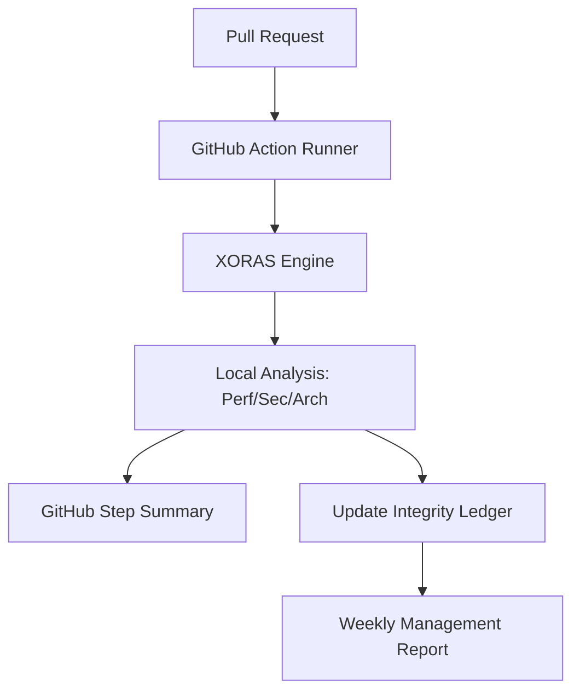

# XORAS: Technical Architecture & Security Model

This document provides a high-fidelity overview of the XORAS Release Integrity engine for engineering leads and institutional stakeholders.

## 1. Core Philosophy: Zero-Knowledge Integrity
XORAS is designed to provide engineering governance without the security risks associated with traditional SaaS security tools. 

- **Local Execution**: The XORAS engine runs entirely within your existing CI/CD runner (GitHub Actions). 
- **Code Privacy**: Source code is analyzed locally. XORAS **never** exfiltrates your codebase or secrets to an external server.
- **Deterministic Logic**: We replace "LLM-based guessing" with deterministic heuristics for performance drift, security regressions, and architectural bloat.

---

## 2. The Integrity Engine Components

### A. Telemetry Gatherer
Identifies critical signals from the current build environment:
- **Performance**: Measures latency drift against a defined institutional baseline.
- **Security**: Scans for high-entropy strings and known credential patterns in the commit diff.
- **Architecture**: Analyzes dependency trees to detect "bloat" (unauthorized package additions).

### B. Policy Evaluator (Advisory vs. Enforcement)
XORAS operates in two distinct modes:
- **ADVISORY (Pilot Standard)**: Non-blocking feedback. XORAS surfaces warnings in the PR Step Summary but allows the build to proceed.
- **ENFORCEMENT**: Blocks merges that violate institutional integrity thresholds (e.g., >25% latency regression).

### C. The Integrity Ledger (`integrity_ledger.json`)
Every release event is recorded in a tamper-evident, cryptographically signed ledger. 
- **Auditability**: Provides a verifiable history of governance exceptions and prevented incidents.
- **Management Visibility**: Powers the automated Weekly Governance Reports.

---

## 3. Data Flow & Integration

## 4. Security & Compliance
- **Authentication**: XORAS uses standard GitHub OIDC/Tokens. No external credentials required.
- **Audit Trail**: Every policy decision is signed and logged, meeting SOC2/ISO27001 requirements for release governance.

---
*For technical inquiries or custom baseline calibration, contact the XORAS Pilot Support team.*
