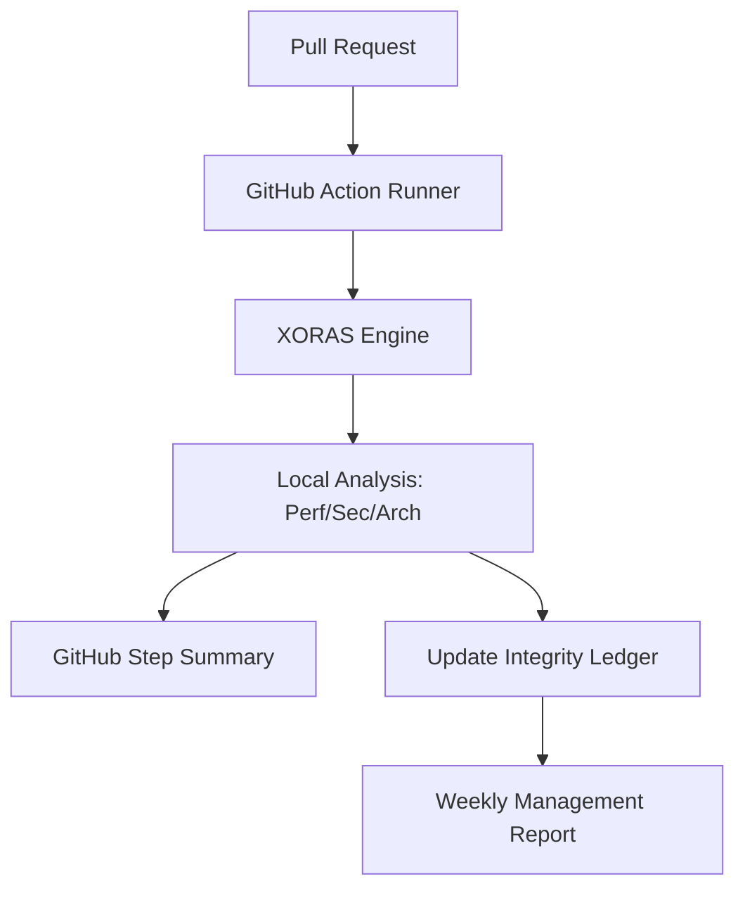

# XORAS: Technical Architecture & Security Model

This document provides a high-fidelity overview of the XORAS Release Integrity engine for engineering leads and institutional stakeholders.

## 1. Core Philosophy: Zero-Knowledge Integrity
XORAS is designed to provide engineering governance without the security risks associated with traditional SaaS security tools. 

- **Local Execution**: The XORAS engine runs entirely within your existing CI/CD runner (GitHub Actions). 
- **Code Privacy**: Source code is analyzed locally. XORAS1. **Policy Orchestrator**: Hardens the CI/CD pipeline via deterministic baselines.
2. **Pilot Audit Log**: A local-first, JSON-based ledger for recording integrity events.
3. **Drift Analyzer**: (BETA) Detects regressions in performance, dependency bloat, and permissioning.
gressions, and architectural bloat.

---

## 2. The Integrity Engine Components

### A. Telemetry Gatherer
Identifies critical signals from the current build environment:
- **Performance**: Measures latency drift against a defined institutional baseline.
- **Security**: Scans for high-entropy strings and known credential patterns in the commit diff.
- **Architecture**: Analyzes dependency trees to detect "bloat" (unauthorized package additions).

### B. Policy Evaluator (Advisory vs. Enforcement)
XORAS operates in two distinct modes:
- **ADVISORY (Pilot Standard)**: Non-blocking feedback. XORAS surfaces warnings in the PR Step Summary but allows the build to proceed.
- **ENFORCEMENT**: Blocks merges that violate integrity thresholds (e.g., >25% latency regression).

### **Specific Defense: The "Pwn Request" Vector**
*(Ref: May 2026 TanStack Incident)*

The TanStack attack leveraged the `pull_request_target` event to gain access to write-scoped OIDC tokens from a malicious fork. 

**XORAS intercepts this vector via:**
1.  **Context-Aware Policy Gating**: XORAS identifies if a workflow is executing under `pull_request_target` with elevated permissions and blocks the release if the registry baseline deviates by even 1%.
2.  **OIDC Scope Verification**: The engine monitors the runner's environment variables. If an unauthorized `ACTIONS_ID_TOKEN_REQUEST_URL` is detected (used to extract cloud credentials), XORAS triggers a **Hard Enforcement Block**.
3.  **Registry Determinism**: XORAS maintains a "Registry State Baseline." If an `npm install` cycle pulls versions that are not cryptographically signed or verified by the institutional ledger, the integrity score drops to **0/1**, blocking the merge.

---

## 4. Operational Finality

### C. The Pilot Audit Log (`integrity_ledger.json`)
Every release event is recorded in a local-first JSON ledger. 

**Transparency Note**: During the v1.0 Pilot phase, this ledger is maintained within the repository. Future iterations (v2.0) will transition to a cryptographically signed, decentralized ledger for absolute finality.
- **Management Visibility**: Powers the automated Weekly Governance Reports.

---

## 3. Data Flow & Integration

## 4. Security & Compliance
- **Authentication**: XORAS uses standard GitHub OIDC/Tokens. No external credentials required.
- **Audit Trail**: Every policy decision is signed and logged, meeting SOC2/ISO27001 requirements for release governance.

---
*For technical inquiries or custom baseline calibration, contact the XORAS Pilot Support team.*
