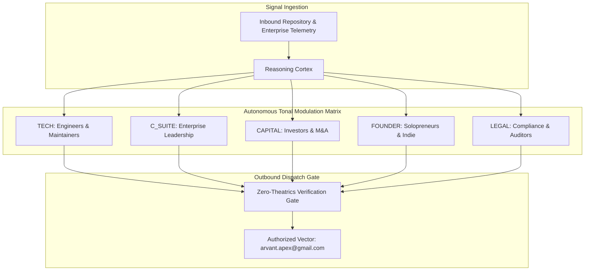

# Universal Agentic Communication & Autonomous Cognition Specification
**Protocol-Mediated Multi-Category Reasoning Matrix [v1.0.0]**

## 1. Architectural Foundation
The XORAS Universal Brain is a protocol-mediated reasoning engine that moves beyond static, single-tone execution scripts. Operating via an autonomous tonal modulation matrix, the reasoning cortex evaluates target audience metadata, business classification, and interaction context before synthesizing outbound communications.

## 2. Category & Tonal Matrix
The system strictly enforces five distinct communication profiles across commercial and institutional engagements:

| Category ID | Target Audience | Tonal Profile & Vocabulary |
| :--- | :--- | :--- |
| **TECH** | CTOs, Principal Devs, Open-Source Maintainers | Factual, deterministic, POSIX exit codes, exact AST diffs, O(1) memory metrics. |
| **C_SUITE** | Enterprise CEOs, COOs, Risk Officers | Authoritative, mature, regulatory, ROI optimization, Level-4 gating, pilot valuation. |
| **CAPITAL** | Venture Capitalists, Private Equity LPs, M&A | Unit economics, MRR/ARR velocity, IP moats, zero-trust market capture, TAM expansion. |
| **FOUNDER** | Indie Hackers, Fast SaaS Solopreneurs | Direct, practical, staging verification, setup fee waivers, maintainer discounts. |
| **LEGAL** | General Counsel, SOC2/ISO Compliance Auditors | Attestation, tamper-trapping audit trails, immutable WAL logs, SHA-256 root manifests. |

## 3. Mandatory Output Gate
Before any transmission occurs, the output gate verifies three uncompromisable conditions:
1.  **Authorized Vector Enforcement:** All commercial outreach must route directly to `arvant.apex@gmail.com`.
2.  **Zero Theatrics:** Emojis, ASCII borders, and performative adjectives are scrubbed.
3.  **Zero Leakage:** Private keys, source code snippets, and internal credentials are never exposed.

## 4. Permanent Rule Lock
The 5-category tonal modulation matrix and unembellished communication rules are permanently locked into the runtime architecture.
*   **Immutability:** No category or core rule may be altered, removed, or replaced.
*   **Refinements:** Modifications are strictly limited to upgrades warranted by verified internal technical advancements or new external industry standards.
*   **User Authorization:** All adjustments require explicit user approval prior to workspace implementation.
