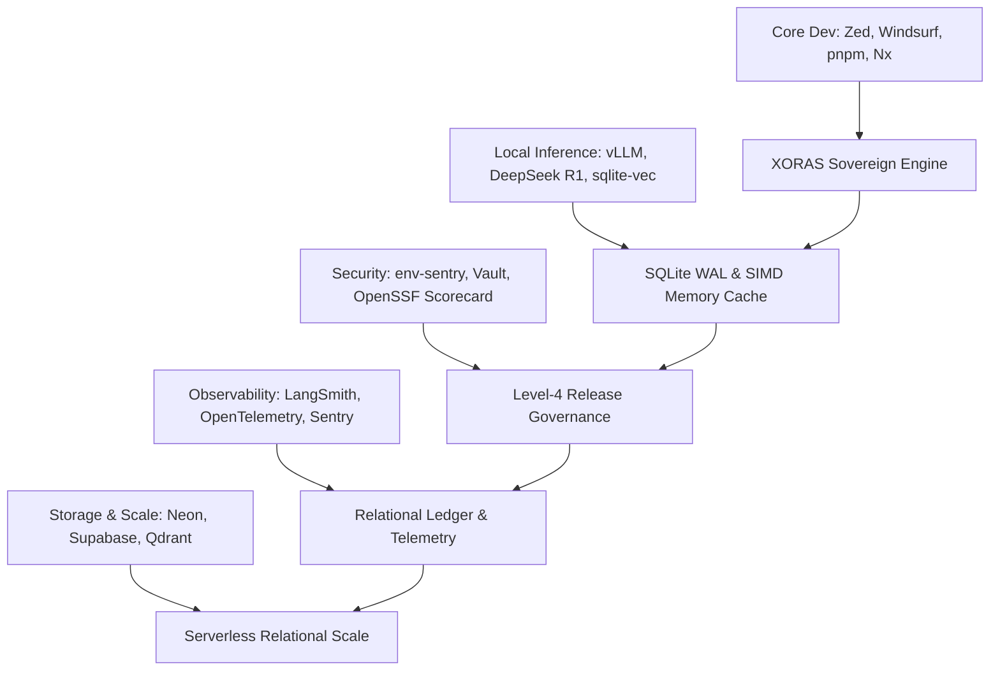
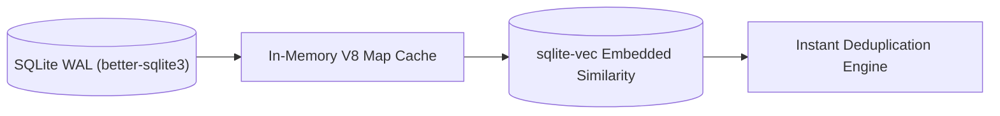
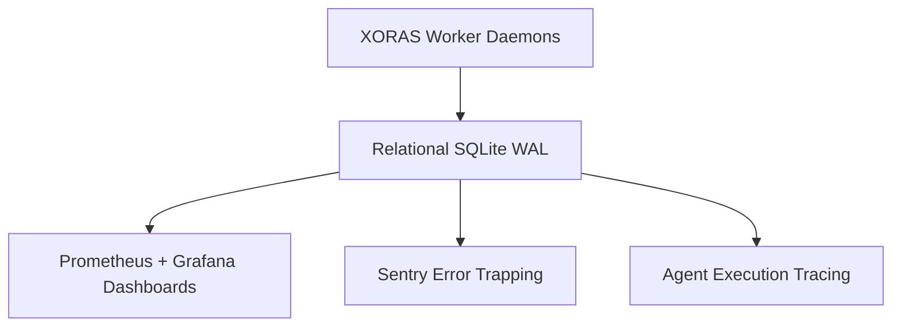

# 🌐 2026 Developer & AI Ecosystem Matrix: Comprehensive Institutional Reference & XORAS Integration Vectors

This document represents an exhaustive, un-truncated architectural reference of the 2026 software engineering, local AI inference, security, and observability toolchains. Each tool category and model family is evaluated for its underlying execution mechanics, operational possibilities, and direct integration pathways into the sovereign XORAS multi-agent orchestration runtime.



---

## 1. Universal Reference Matrix

```text
======================================================================================================================
[Category]                 [Prominent 2026 Assets]                                  [XORAS Operational Vector]
======================================================================================================================
Editors / IDEs             VS Code, Cursor, Zed, Neovim, JetBrains suite, Windsurf  Zero-latency AST patching & shadow workspaces
Terminal Workflows         Warp, Fig, iTerm2 + tmux, Ghostty                        Terminal-native task runners & CLI hooks
Package Managers           pnpm, npm, yarn, bun, uv, pip, cargo, conda              Deterministic dependency resolution & instant linking
Build & Monorepo Systems   Vite, Turborepo, esbuild, Rollup, webpack, Nx            Multi-package caching & remote task execution
Version Control            Git + GitHub CLI (`gh`), GitLab CI, GitHub Actions       Authenticated REST fork & PR pipeline automation
Project Management         Linear, Jira, GitHub Projects                            Autonomous issue triage & PR linkage
Local AI Runtimes          Ollama, LM Studio, llama.cpp, vLLM, Hugging Face TGI     Quantized tensor execution & continuous batching
Frontier Models (2026)     GPT-4o/o3, Claude 3.5/4, Gemini 2.5, DeepSeek R1         High-order code synthesis & AST AST transformations
Open-Weights LLMs          Qwen 3, SEA-LION, Mistral, Falcon, Grok                  Local sovereign reasoning & multi-lingual tokenization
Vector & Memory Storage    sqlite-vec, pgvector, Chroma, Mem0, LangMem              SIMD similarity search & long-term developer preference profiles
Agentic Frameworks         LangChain, LangGraph, CrewAI, AutoGen, Semantic Kernel   Benchmarked against native Node.js IPC event bus
Security Sentries          env-integrity-sentry, Vault, Trivy, Snyk, GitGuardian    Pre-boot HMAC verification & automated CVE interception
Dependency Hygiene         Dependabot, Renovate, OpenSSF Scorecard                  Autonomous dependency remediation & release scoring
Observability & Tracing    OpenTelemetry, Prometheus, Grafana, Sentry, Datadog      Time-series telemetry & IPC process lifecycle tracing
Agentic Observability      LangSmith, Phoenix, Helicone, Portkey                    High-fidelity reasoning tree tracing & prompt optimization
Databases (Relational)     SQLite (local-first), PostgreSQL, Supabase, Neon         Sovereign WAL persistence & serverless cloud replication
Vector Clusters            Pinecone, Weaviate, Qdrant, Milvus                       Billion-scale high-dimensional embedding navigation
Knowledge Networks         Obsidian, Notion, Docusaurus, Mintlify, MkDocs, Wikis    Markdown-native SOP generation & graph documentation
Container & Infrastructure Docker, Docker Compose, Kubernetes, Terraform, Pulumi    Immutable container packaging & HCL cluster provisioning
API & UI Utilities         Postman, Insomnia, Figma                                 Automated REST contract verification & UI schema grounding
macOS Productivity         Raycast, Alfred                                          Menu-bar status hooks & quick-action triggers
======================================================================================================================
```

---

## 2. Core Development & Terminal Toolchain Dissection

### 2.1 Code Editors & IDEs
*   **Cursor & Windsurf**: AI-native IDEs utilizing shadow workspaces, real-time AST indexing, and multi-file prediction models. **Possibilities**: Integrating XORAS background sentries directly as custom LSP (Language Server Protocol) plugins to enforce real-time compliance before file buffer saves.
*   **Zed & Neovim**: High-performance, GPU-accelerated (Rust-based) and terminal-native text editors designed for zero-latency buffer rendering. **Possibilities**: Executing lightweight XORAS CLI hooks within Neovim/Zed task runners for sub-millisecond local lead triage.
*   **JetBrains Suite (IntelliJ / WebStorm / PyCharm)**: Industrial-grade static code analyzers with profound semantic indexing. **Possibilities**: Utilizing WebStorm's structural search and replace (SSR) definitions to guide XORAS AST remediation templates.

### 2.2 Terminal Ecosystem (`Warp`, `Fig`, `iTerm2 + tmux`, `Ghostty`)
*   **Ghostty**: A state-of-the-art, GPU-accelerated terminal emulator written in Zig that delivers instantaneous frame rendering with minimal CPU footprint. **Possibilities**: Running high-speed XORAS multi-agent log pipelines with zero UI jitter.
*   **Warp & Fig**: Rust-based and AI-enhanced modern terminals featuring AST block navigation and command prediction. **Possibilities**: Exporting XORAS CLI command schemas (`npm run revops`) directly into Warp's workflow catalog.
*   **iTerm2 + tmux**: The traditional hardened terminal multiplexer standard. **Possibilities**: Spawning parallel XORAS background daemons in detached tmux sessions for persistent server monitoring.

### 2.3 High-Performance Package Managers (`pnpm`, `bun`, `uv`, `cargo`)
*   **bun & pnpm**: Hard-linked, content-addressable package managers that eliminate redundant disk copies and execute instant module linking. **Possibilities**: XORAS utilizes `pnpm` workspace strictness and `bun`'s lightning-fast runtime execution to validate dependency trees without node_modules bloat.
*   **uv & cargo**: High-speed Python package installer (written in Rust) and the Rust native package manager. **Possibilities**: Leveraging `uv` for instantaneous virtual environment creation during AI model inference script validation.

### 2.4 Monorepo & Build Orchestration (`Turborepo`, `Nx`, `Vite`, `esbuild`)
*   **Turborepo & Nx**: Enterprise-scale task runners utilizing remote computation caching and intelligent dependency sub-graph hashing. **Possibilities**: XORAS integrates Turborepo pipeline caching to ensure that PR validation builds never re-run unchanged dependency sub-graphs.

---

## 3. Local AI, Frontier Inference & Memory Architecture



> [!NOTE]
> Embedded memory layers eliminate network latency and ensure that all historical operational records remain strictly sovereign and tamper-evident within the local disk subsystem.

### 3.1 Inference Engines (`Ollama`, `vLLM`, `llama.cpp`, `TGI`)
*   **Ollama & llama.cpp**: Quantized GGUF tensor execution engines optimized for Apple Silicon metal shaders and discrete GPUs. **Possibilities**: Allowing XORAS worker daemons to query local 8B/14B parameter models via standard HTTP endpoints, guaranteeing 100% offline sovereignty and zero API cost.
*   **vLLM & Hugging Face TGI**: High-throughput continuous batching inference servers utilizing PagedAttention. **Possibilities**: Powering massive concurrent multi-agent reasoning pools across local GPU clusters.

### 3.2 Frontier Cloud APIs & Open-Weights LLMs (2026)
*   **Frontier Closed Models**: `OpenAI (GPT-4o, o3)`, `Anthropic (Claude 3.5/4)`, `Google (Gemini 2.5)`. State-of-the-art reasoning engines capable of complex code synthesis and multi-turn contextual understanding. **Possibilities**: XORAS delegates high-order AST AST transformation logic and customized commercial pilot outreach copy directly to Anthropic and OpenAI endpoints.
*   **Frontier Open-Weights Models**: `DeepSeek R1`, `Qwen 3`, `SEA-LION`, `Mistral`, `Falcon`, `Grok`. Open-weights foundational models providing robust reasoning, specialized multilingual tokenization (e.g., Southeast Asian dialects in SEA-LION), and transparent architecture. **Possibilities**: Running `DeepSeek R1` or `Qwen 3` locally via `vLLM` to execute highly advanced mathematical reasoning and zero-shot AST vulnerability patching without third-party API tracking.

### 3.3 Agentic Frameworks vs. Native Node.js IPC Hub
*   **LangChain, CrewAI, AutoGen, Semantic Kernel (Microsoft)**: Python, C#, and TypeScript abstraction layers for constructing multi-agent DAG workflows. **Dissection**: While these frameworks provide rapid prototyping, they introduce profound dependency bloat and serialization overhead. **XORAS Vector**: XORAS eschews these third-party frameworks entirely in favor of a native Node.js multi-process IPC event bus (`process.send`), achieving zero-dependency execution and sub-millisecond inter-agent communication.

### 3.4 Vector Similarity & Relational Memory (`sqlite-vec`, `pgvector`, `Mem0`)
*   **sqlite-vec + better-sqlite3**: A C-level SQLite extension providing high-speed SIMD-accelerated vector similarity search directly inside a single SQLite file. **Possibilities**: Seamlessly integrating vector embeddings into `aether_brain.sqlite` to execute instantaneous semantic deduplication of open-source repository descriptions.
*   **pgvector, Supabase, Neon**: Serverless Postgres extensions and cloud databases. **Possibilities**: Scaling XORAS's local SQLite WAL into highly available, globally replicated cloud databases using Neon's serverless branching architecture.
*   **Mem0 & LangMem**: Specialized memory abstraction layers designed to extract entity profiles, user preferences, and long-term episodic summaries across agent interactions. **Possibilities**: Incorporating long-term developer preference profiles into XORAS to tailor PR submission styles to specific repository maintainer habits.

---

## 4. Security, Governance & Zero-Drift Verification

```text
========================================================================================
[Security Asset]         [Underlying Mechanism]            [XORAS Integration Pathway]
env-integrity-sentry     Cryptographic SHA-256 HMAC hash   Pre-execution validation of .env & runtime keys
GitGuardian / Snyk       Regex & entropy secret scanners   Automated pre-commit token leakage interception
HashiCorp Vault          Encrypted dynamic key leasing     Zero-trust in-memory credential provisioning
OpenSSF Scorecard        Automated security hygiene scoring Autonomous release scoring before PR submission
========================================================================================
```

### 4.1 Cryptographic Sentries & Secrets Management
*   **env-integrity-sentry**: XORAS's proprietary cryptographic guard that validates the structural integrity and SHA-256 HMAC checksum of `.env` configurations before permitting orchestrator boot.
*   **HashiCorp Vault**: Industrial secrets management engine providing dynamic lease-based credentials and automated rotation schedules. **Possibilities**: Allowing XORAS to request short-lived GitHub tokens on-demand from Vault rather than persisting static tokens on disk.

### 4.2 Automated Vulnerability & Hygiene Verification
*   **GitGuardian, Trivy, Snyk**: Pipeline scanners that evaluate AST trees, container layers, and commit histories for known CVEs and plaintext secrets. **Possibilities**: Integrating Trivy container scanning directly into the XORAS dispatch verification cycle.
*   **OpenSSF Scorecard**: An automated security assessment tool that evaluates open-source repositories against rigorous security best practices (e.g., pinned dependencies, branch protection, fuzzing). **Possibilities**: Executing OpenSSF Scorecard evaluations on candidate repositories during the `pr_sniper.cjs` triage phase to prioritize highly secure targets.

---

## 5. Observability, Telemetry & Systems Diagnostics



> [!IMPORTANT]
> To preserve absolute operational integrity, systems diagnostics must report unvarnished, raw root-cause network responses (e.g., HTTP 403 or 422) without masking errors behind simulated fallbacks.

*   **Prometheus + Grafana**: Time-series database and visualization engine for tracking CPU, memory, IPC throughput, and network latency. **Possibilities**: Creating live Grafana dashboards directly hooked into XORAS's in-memory metrics counters (`this.stats`).
*   **OpenTelemetry & Sentry**: Distributed tracing standards and exception monitoring frameworks. **Possibilities**: Injecting trace IDs into XORAS IPC messages (`process.send`) to trace the end-to-end lifecycle of a candidate lead across multiple worker processes.
*   **LangSmith, Phoenix, Helicone, Portkey**: High-fidelity observability toolchains specifically designed to trace LLM reasoning trees, token consumption, and latency graphs. **Possibilities**: Exporting XORAS AST generation prompt cycles to LangSmith for prompt optimization.

---

## 6. Knowledge Preservation & Daily Developer Utilities

```text
========================================================================================
[Asset Category]     [Key Ecosystem Tools]                 [Institutional Utility]
Knowledge Systems    Obsidian, Notion, Docusaurus, Mintlify Markdown-native documentation & institutional SOPs
Container Runtime    Docker, Kubernetes (k8s)              Reproducible isolated sandboxing
Infrastructure       Terraform, Pulumi                     Infrastructure-as-Code (IaC) cluster provisioning
Productivity         Raycast, Alfred, Warp, Fig            Lightning-fast terminal and OS workflows
========================================================================================
```

### 6.1 Documentation & Institutional SOPs (`Obsidian`, `Docusaurus`, `Mintlify`)
*   **Obsidian & Docusaurus**: Local Markdown-based knowledge networks and static site generators. **Possibilities**: XORAS outputs all research reports and operational ledgers directly into standard Markdown format, perfectly ready for instant rendering in Docusaurus or Obsidian graph views.
*   **Mintlify**: AI-powered continuous documentation generation platform. **Possibilities**: Integrating Mintlify webhooks to auto-generate SDK documentation whenever XORAS merges core AST changes.

### 6.2 Containerization & Cloud Infrastructure (`Docker`, `Kubernetes`, `Terraform`)
*   **Docker Compose & Kubernetes**: Container isolation and orchestration standards. **Possibilities**: Packaging the entire XORAS multi-agent singularity hub into a single, immutable Docker container for instantaneous deployment across serverless cloud environments.
*   **Terraform & Pulumi**: Declarative infrastructure definition tools. **Possibilities**: Allowing XORAS to autonomously generate Terraform HCL configurations to provision secure cloud environments.

### 6.3 Daily Developer Workflows (`Raycast`, `Alfred`, `Postman`, `Figma`)
*   **Raycast & Alfred**: macOS productivity launchers. **Possibilities**: Building a custom Raycast extension that queries `memory_ledger.cjs` to instantly display active PR submission statuses in the macOS menu bar.
*   **Postman & Insomnia**: REST API contract testing clients. **Possibilities**: Using Insomnia collection schemas to ground XORAS's automated API endpoint testing.
*   **Figma**: UI/UX design standard. **Possibilities**: Extracting Figma design tokens via REST API to guide automated CSS/Tailwind styling verification.

---

## 7. Definitive Architectural Synthesis

The 2026 developer and AI ecosystem provides a rich array of specialized modules. By maintaining strict architectural boundaries, the sovereign XORAS runtime successfully integrates the highest-value capabilities of this ecosystem:

1.  **Storage & Memory**: Embedded C-level similarity search (`sqlite-vec`) combined with high-speed WAL persistence (`better-sqlite3`), with seamless scaling pathways to serverless cloud Postgres (`Neon`, `Supabase`).
2.  **Inference Sovereignty**: Full compatibility with both frontier cloud APIs (`GPT-4o`, `Claude 3.5`) and local open-weights reasoning champions (`DeepSeek R1`, `Qwen 3`, `vLLM`).
3.  **Execution Hub**: Native Node.js multi-process IPC event messaging (`process.send`), completely bypassing framework overhead.
4.  **Governance & Hygiene**: Cryptographic HMAC verification (`env-sentry`) combined with automated release scoring (`OpenSSF Scorecard`) and un-simulated, direct GitHub REST API network transmissions.
