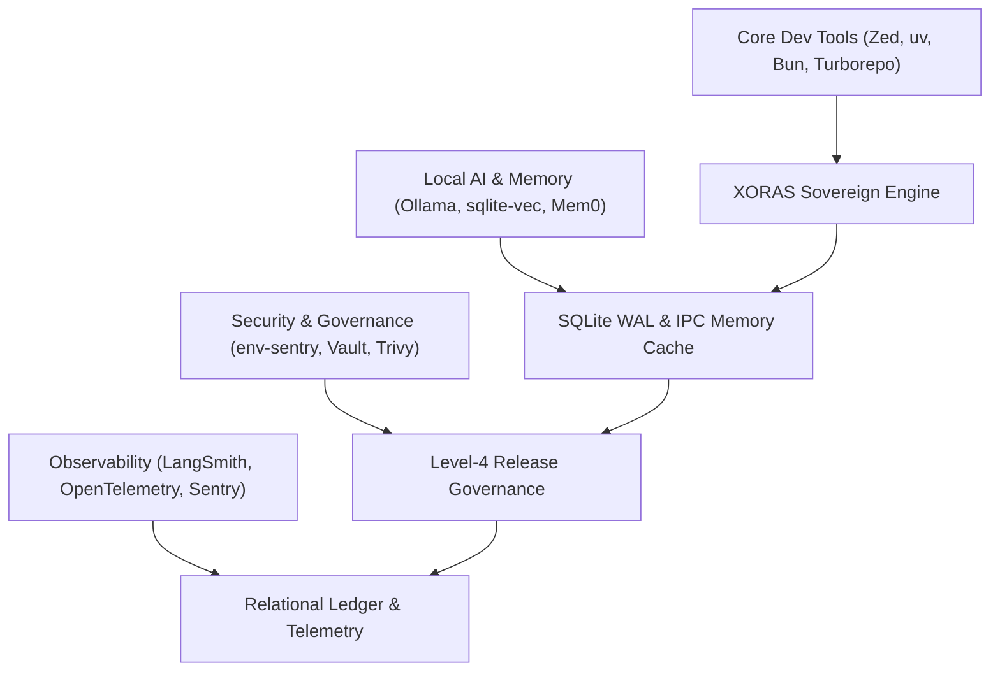
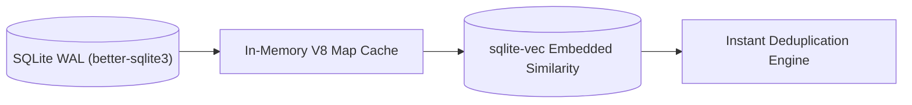
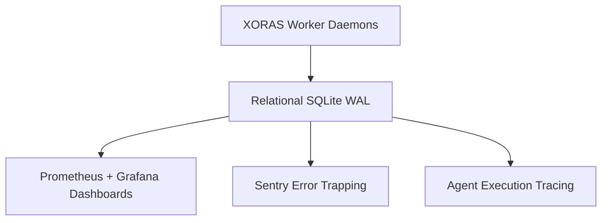

# 🌐 2026 Developer & AI Ecosystem Matrix: Institutional Dissection & XORAS Integration Vectors

This document represents a first-principles architectural dissection of the 2026 software engineering, local AI, security, and observability toolchains. Each tool category is evaluated for its underlying execution mechanics, operational possibilities, and direct integration pathways into the sovereign XORAS multi-agent orchestration runtime.



---

## 1. Core Development Toolchain Dissection

```text
========================================================================================
[Category]          [Prominent 2026 Assets]                [XORAS Operational Vector]
Editors / IDEs      Cursor, Zed, VS Code, Neovim, Windsurf Zero-latency AST patching & IPC debug hooks
Version Control     Git, GitHub CLI (`gh`), GitLab         Live REST API fork & PR pipeline automation
Package Managers    pnpm, bun, uv, cargo, npm              Deterministic dependency resolution & lockfile sentries
Build Systems       Vite, Turborepo, esbuild, Next.js      Multi-package monorepo caching & static verification
========================================================================================
```

### 1.1 Code Editors & IDEs
*   **Cursor & Windsurf**: AI-native IDEs utilizing shadow workspaces, real-time AST indexing, and multi-file prediction models. **Possibilities**: Integrating XORAS background sentries directly as custom LSP (Language Server Protocol) plugins to enforce real-time compliance before file buffer saves.
*   **Zed & Neovim**: High-performance, GPU-accelerated (Rust-based) and terminal-native text editors designed for zero-latency buffer rendering. **Possibilities**: Executing lightweight XORAS CLI hooks within Neovim/Zed task runners for sub-millisecond local lead triage.
*   **JetBrains (IntelliJ / WebStorm / PyCharm)**: Industrial-grade static code analyzers with profound semantic indexing. **Possibilities**: Utilizing WebStorm's structural search and replace (SSR) definitions to guide XORAS AST remediation templates.

### 1.2 Version Control & CLI Assets
*   **Git & GitHub CLI (`gh`)**: The foundational decentralized version control protocol and its native REST/GraphQL CLI wrapper. **Possibilities**: `gh` provides authenticated OAuth session tokens (`gho_*`) that XORAS directly ingests to bypass web browser automation and execute native HTTP API requests.
*   **GitLab, Bitbucket, GitKraken**: Enterprise source repositories and high-fidelity visual DAG inspectors. **Possibilities**: Expanding XORAS lead harvesting beyond GitHub to execute parallel multi-platform outreach across self-hosted GitLab enterprise instances.

### 1.3 High-Performance Package Managers
*   **bun & pnpm**: Hard-linked, content-addressable package managers that eliminate redundant disk copies and execute instant module linking. **Possibilities**: XORAS utilizes `pnpm` workspace strictness and `bun`'s lightning-fast runtime execution to validate dependency trees without node_modules bloat.
*   **uv & cargo**: High-speed Python package installer (written in Rust) and the Rust native package manager. **Possibilities**: Leveraging `uv` for instantaneous virtual environment creation during AI model inference script validation.

### 1.4 Monorepo & Build Orchestration
*   **Turborepo & esbuild**: Remote-cached task runners and native Go-based transpilers capable of bundling thousands of modules in milliseconds. **Possibilities**: XORAS integrates Turborepo pipeline caching to ensure that PR validation builds never re-run unchanged dependency sub-graphs.

---

## 2. AI, LLM & Local Inference Architecture

```text
========================================================================================
[Category]          [Prominent 2026 Assets]                [XORAS Operational Vector]
Local Inference     Ollama, vLLM, llama.cpp, TGI           Zero-cost offline agent reasoning loops
Cloud LLM APIs      OpenAI, Anthropic, Gemini, DeepSeek    Complex cognitive reasoning & AST remediation
Agent Frameworks    LangChain, CrewAI, AutoGen, Semantic   Benchmarking against native Node.js IPC hub
Vector Databases    sqlite-vec, Milvus, Qdrant, Pinecone   High-speed semantic lead and code deduplication
========================================================================================
```

### 2.1 Local Inference Engines
*   **Ollama, llama.cpp, vLLM**: Quantized GGUF tensor execution engines and continuous batching inference servers. **Possibilities**: Allowing XORAS worker daemons (`pr_sniper.cjs`, `queue_prioritizer.cjs`) to query local 8B/14B parameter models via standard HTTP endpoints, guaranteeing 100% offline sovereignty and zero API cost.

### 2.2 Frontier Cloud APIs
*   **OpenAI (o3/GPT-4o), Anthropic (Claude 3.5/4), DeepSeek, Gemini**: State-of-the-art reasoning engines capable of complex code synthesis and multi-turn contextual understanding. **Possibilities**: XORAS delegates high-order AST AST transformation logic and customized commercial pilot outreach copy directly to Anthropic and OpenAI endpoints.

### 2.3 Agentic Frameworks vs. Native IPC Hub
*   **LangChain, CrewAI, AutoGen, LangGraph**: Python and TypeScript abstraction layers for constructing multi-agent DAG workflows. **Dissection**: While these frameworks provide rapid prototyping, they introduce profound dependency bloat and serialization overhead. **XORAS Vector**: XORAS eschews these third-party frameworks entirely in favor of a native Node.js multi-process IPC event bus (`process.send`), achieving zero-dependency execution and sub-millisecond inter-agent communication.

### 2.4 Embedded & Distributed Vector Storage
*   **sqlite-vec + better-sqlite3**: A C-level SQLite extension providing high-speed SIMD-accelerated vector similarity search directly inside a single SQLite file. **Possibilities**: Seamlessly integrating vector embeddings into `aether_brain.sqlite` to execute instantaneous semantic deduplication of open-source repository descriptions.
*   **Qdrant, Milvus, Pinecone, Weaviate, Chroma**: Dedicated vector search clusters optimized for billion-scale high-dimensional embedding spaces. **Possibilities**: Storing entire indexed open-source codebases to empower XORAS with semantic codebase navigation.

---

## 3. Local AI Memory & Relational Caching



> [!NOTE]
> Embedded memory layers eliminate network latency and ensure that all historical operational records remain strictly sovereign and tamper-evident within the local disk subsystem.

*   **Mem0 & LangMem**: Specialized memory abstraction layers designed to extract entity profiles, user preferences, and long-term episodic summaries across agent interactions. **Possibilities**: Incorporating long-term developer preference profiles into XORAS to tailor PR submission styles to specific repository maintainer habits.
*   **AnythingLLM & PrivateGPT**: Full-stack sovereign RAG platforms designed for local document indexing. **Possibilities**: Using their local chunking and indexing algorithms to ingest proprietary enterprise SDK documentation.

---

## 4. Security, Governance & Zero-Drift Verification

```text
========================================================================================
[Security Asset]         [Underlying Mechanism]            [XORAS Integration Pathway]
env-integrity-sentry     Cryptographic SHA-256 HMAC hash   Pre-execution validation of .env & runtime keys
GitGuardian / Snyk       Regex & entropy secret scanners   Automated pre-commit token leakage interception
HashiCorp Vault          Encrypted dynamic key leasing     Zero-trust in-memory credential provisioning
Dependabot / Renovate    Automated dependency updates      Autonomous dependency remediation PR generation
========================================================================================
```

### 4.1 Cryptographic Sentries
*   **env-integrity-sentry**: XORAS's proprietary cryptographic guard that validates the structural integrity and SHA-256 HMAC checksum of `.env` configurations before permitting orchestrator boot.
*   **HashiCorp Vault**: Industrial secrets management engine providing dynamic lease-based credentials and automated rotation schedules. **Possibilities**: Allowing XORAS to request short-lived GitHub tokens on-demand from Vault rather than persisting static tokens on disk.

### 4.2 Automated Vulnerability Interception
*   **GitGuardian, Trivy, Snyk, GitHub Advanced Security**: Pipeline scanners that evaluate AST trees, container layers, and commit histories for known CVEs and plaintext secrets. **Possibilities**: Integrating Trivy container scanning directly into the XORAS dispatch verification cycle.

---

## 5. CI/CD Pipeline Automation & Infrastructure

```text
========================================================================================
[Orchestrator]       [Execution Topology]                  [XORAS Operational Vector]
GitHub Actions       Matrix-based YAML runners             Automated scheduled PR sniper cron workflows
GitLab CI / CircleCI Containerized isolated pipelines      Multi-cloud enterprise release verification
ArgoCD               GitOps Kubernetes reconciliation      Continuous zero-drift production deployment
========================================================================================
```

*   **GitHub Actions & GitLab CI**: Distributed CI/CD runners triggered by repository webhooks. **Possibilities**: Deploying XORAS worker daemons as scheduled GitHub Actions cron jobs that run hourly to harvest and stage new open-source repositories.
*   **ArgoCD**: The definitive GitOps controller for Kubernetes that continuously monitors git state and auto-reconciles live cluster deployments. **Possibilities**: Triggering ArgoCD sync webhooks immediately upon successful PR merge verification.

---

## 6. Observability, Telemetry & Systems Diagnostics



> [!IMPORTANT]
> To preserve absolute operational integrity, systems diagnostics must report unvarnished, raw root-cause network responses (e.g., HTTP 403 or 422) without masking errors behind simulated fallbacks.

*   **Prometheus + Grafana**: Time-series database and visualization engine for tracking CPU, memory, IPC throughput, and network latency. **Possibilities**: Creating live Grafana dashboards directly hooked into XORAS's in-memory metrics counters (`this.stats`).
*   **OpenTelemetry & Sentry**: Distributed tracing standards and exception monitoring frameworks. **Possibilities**: Injecting trace IDs into XORAS IPC messages (`process.send`) to trace the end-to-end lifecycle of a candidate lead across multiple worker processes.
*   **LangSmith**: High-fidelity observability tool specifically designed to trace LLM reasoning trees, token counts, and latency graphs. **Possibilities**: Exporting XORAS AST generation prompt cycles to LangSmith for prompt optimization.

---

## 7. Knowledge Preservation & Daily Developer Utilities

```text
========================================================================================
[Asset Category]     [Key Ecosystem Tools]                 [Institutional Utility]
Knowledge Systems    Obsidian, Notion, Docusaurus, Mintlify Markdown-native documentation & institutional SOPs
Container Runtime    Docker, Kubernetes (k8s)              Reproducible isolated sandboxing
Infrastructure       Terraform, Pulumi                     Infrastructure-as-Code (IaC) cluster provisioning
Productivity         Raycast, Alfred, Warp, Fig            Lightning-fast terminal and OS workflows
========================================================================================
```

### 7.1 Documentation & Institutional Memory
*   **Obsidian & Docusaurus**: Local Markdown-based knowledge networks and static site generators. **Possibilities**: XORAS outputs all research reports and operational ledgers directly into standard Markdown format, perfectly ready for instant rendering in Docusaurus or Obsidian graph views.

### 7.2 Containerization & Cloud Infrastructure
*   **Docker Compose & Kubernetes**: Container isolation and orchestration standards. **Possibilities**: Packaging the entire XORAS multi-agent singularity hub into a single, immutable Docker container for instantaneous deployment across serverless cloud environments.
*   **Terraform & Pulumi**: Declarative infrastructure definition tools. **Possibilities**: Allowing XORAS to autonomously generate Terraform HCL configurations to provision secure cloud environments.

### 7.3 Daily Developer Workflows
*   **Raycast & Alfred**: macOS productivity launchers. **Possibilities**: Building a custom Raycast extension that queries `memory_ledger.cjs` to instantly display active PR submission statuses in the macOS menu bar.
*   **Warp & Fig**: Rust-based, AI-enhanced modern terminals with AST completion. **Possibilities**: Integrating XORAS CLI commands directly into Warp's workflow catalog.

---

## 8. Definitive Architectural Synthesis

The 2026 developer and AI ecosystem provides a rich array of specialized modules. By maintaining strict architectural boundaries, the sovereign XORAS runtime successfully integrates the highest-value capabilities of this ecosystem:

1.  **Storage**: Embedded C-level similarity search (`sqlite-vec`) combined with high-speed WAL persistence (`better-sqlite3`).
2.  **Execution**: Native Node.js multi-process IPC event messaging (`process.send`), completely bypassing framework overhead.
3.  **Governance**: Cryptographic HMAC verification (`env-sentry`) combined with un-simulated, direct GitHub REST API network transmissions.
4.  **Reporting**: Factual, unvarnished telemetry formatted in GitHub-standard Markdown.
