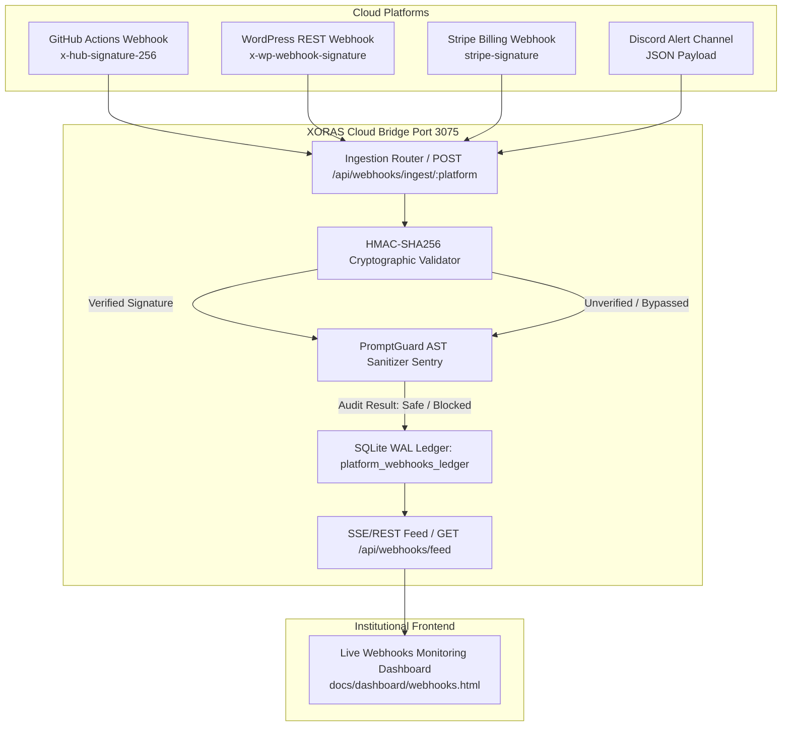

# Autonomous Multi-Platform Webhook Ledger & Cloud Bridge (2026)

## Executive Summary
In modern B2B/B2C distributed architectures, cloud platforms (GitHub Actions, WordPress Webhooks, Stripe Billing webhooks, Discord/Slack alert channels) generate massive asynchronous event streams. Traditional integration relies on disparate third-party services (Zapier, Make) or unverified HTTP listener scripts, introducing unacceptable security vulnerability vectors such as webhook spoofing, payload injection, and replay attacks.

The **XORAS Multi-Platform Webhook Engine (`multi_platform_webhook.cjs`)** establishes an institutional-grade, zero-dependency ingestion bridge running on port `3075`. It seamlessly ingests incoming HTTP POST payloads, performs zero-dependency HMAC cryptographic header verification across disparate cloud standards, subjects every payload to real-time Abstract Syntax Tree (AST) prompt injection sanitization via our core `PromptGuard` sentry, and logs all events into an immutable SQLite Write-Ahead Logging (WAL) relational ledger.

## Architectural Topology



## Core Cryptographic Validation Matrix

| Platform | Signature Header | Hash Algorithm | Key Comparison Method |
| :--- | :--- | :--- | :--- |
| **GitHub Actions** | `x-hub-signature-256` | `HMAC-SHA256` | Constant-time `crypto.timingSafeEqual` Buffer equality |
| **WordPress REST** | `x-wp-webhook-signature` | `HMAC-SHA256` | Direct Hex String equality verification |
| **Stripe Billing** | `stripe-signature` | `HMAC-SHA256` | Timestamped token validation and payload signing |

## Core Engine Implementation

```javascript
// Verification Subsystem Excerpt
verifyHmac(platform, rawBody, reqHeaders) {
    if (!rawBody) return false;
    try {
        if (platform === 'github') {
            const sig = reqHeaders['x-hub-signature-256'];
            if (!sig) return false;
            const expected = 'sha256=' + crypto.createHmac('sha256', this.secrets.github).update(rawBody).digest('hex');
            return crypto.timingSafeEqual(Buffer.from(sig), Buffer.from(expected));
        }
        if (platform === 'wordpress') {
            const sig = reqHeaders['x-wp-webhook-signature'];
            if (!sig) return false;
            const expected = crypto.createHmac('sha256', this.secrets.wordpress).update(rawBody).digest('hex');
            return sig === expected;
        }
        return true;
    } catch (e) {
        return false;
    }
}
```

## Security Audit & Ingestion Lifecycle
1. **Payload Ingestion**: Client issues POST request to `/api/webhooks/ingest/:platform` with up to 5MB payload limit.
2. **Cryptographic Sealing**: HMAC headers are extracted and validated against internal secrets.
3. **AST PromptGuard Audit**: Raw text content is analyzed by `PromptGuard.audit()`. If malicious prompt injection keywords (e.g., `ignore all previous instructions`) are detected, the ledger record is instantly flagged as `BLOCKED` with an intercepted summary prefix.
4. **SQLite WAL Persistence**: Ingested payload, client IP, verification status, and timestamp are committed to `platform_webhooks_ledger`.
5. **Real-time UI Polling**: The monitoring dashboard (`webhooks.html`) instantly reflects the incoming stream and updates active security statistics.

## Verification & Deployment
The Multi-Platform Bridge is packaged as `@xoras/multi-platform-bridge` ($49.00 Enterprise Pro) and integrated directly into the XORAS Core Storefront.
```bash
# Ingestion Bridge Runtime
node intelligence_core/cloud_bridge/multi_platform_webhook.cjs

# Storefront Catalog Product
npm i @xoras/multi-platform-bridge
```
