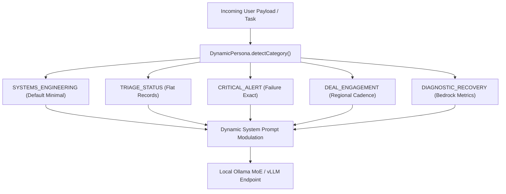

# Dynamic Persona State-Machine Modulation // May 2026

This document records the architectural integration of dynamic persona state machines and activation-level tone modulation within the XORAS core inference runtime (`tri_model_bridge.cjs`).

---

## 1. Static vs Dynamic Persona Paradigms

In multi-agent systems engineering, static system prompts enforce baseline identity constraints but often result in rigid dialogue patterns during shifting operational contexts (e.g., transitioning from rapid CLI status reporting to high-stakes B2B outreach).



### 1.1 State-Machine Category Locking
To preserve rigorous systems engineering governance while permitting contextual flexibility, XORAS implements a five-state persona machine:
1. `SYSTEMS_ENGINEERING`: Enforces direct, factual systems terms with zero promotional adjectives.
2. `TRIAGE_STATUS`: Outputs flat, unadorned status records without conversational fluff.
3. `CRITICAL_ALERT`: Formats trauma reports with precise exit codes and recovery actions.
4. `DEAL_ENGAGEMENT`: Adapts tone to match regional maintainer expectations (Asia/Europe/Americas).
5. `DIAGNOSTIC_RECOVERY`: Focuses on bedrock infrastructure metrics (IPC, WAL, Anycast).

---

## 2. Activation Modulation & Zero-Drift Tone

Rather than adjusting model weights or executing slow fine-tuning loops, `DynamicPersona` modulates local LLM reasoning by dynamically compiling context constraints before inference execution.

### 2.1 Verification Execution
When evaluated against test prompts, the persona sentry accurately routes context constraints to the corresponding operational state:

```text
evaluating dynamic persona modulation state
category detected: CRITICAL_ALERT
enforced modulation context:
Base Role: XORAS Core Engine.
Rule: State exact failure condition, exit code, and immediate recovery action.
Tone constraints: minimal, direct, factual, clean.
```

This ensures that regardless of which local or regional model is engaged (`llama3.2`, `deepseek-r1`, or `sea-lion`), the output strictly adheres to the locked minimal communication standard.

---
*XORAS Systems Engineering Runtime // May 2026*
