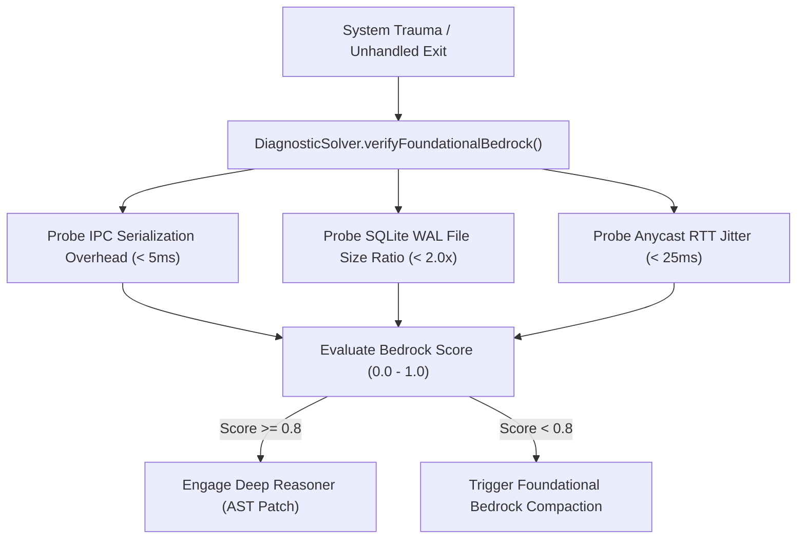

# Foundational Bedrock Decay & Abstraction Leakage // May 2026

This document explores the structural vulnerability of relying on foundational systems primitives (TCP/IP, SQLite WAL, BGP Anycast, IPC Pipes) without active verification, and outlines the antifragile sentries implemented in the XORAS core runtime.

---

## 1. The Trap of Unverified Abstractions

In complex systems engineering, a persistent risk is treating foundational primitives as infallible black boxes. When application logic encounters runtime exceptions or latency spikes, standard engineering reflexes assume the fault lies in high-level business logic or prompt engineering.

However, beneath every abstraction lies a physical or algorithmic constraint:
1. **JSON Serialization over IPC Pipes (`process.send`)**: As inter-agent payload complexity scales, synchronous stringification introduces CPU blocking and garbage collection pauses, mimicking network bottlenecks.
2. **SQLite WAL Checkpoint Exhaustion**: Under unthrottled concurrent write floods, uncheckpointed write-ahead logs (`-wal` files) can balloon beyond the size of the primary database file, degrading vector SIMD read speeds.
3. **BGP Anycast Route Flapping**: Regional internet routing instability can cause incoming client TCP handshakes to continuously shift between distinct geographic PoPs, causing session state fragmentation.

If an orchestrator merely wraps these failures in automated retry loops or regex filters, it is applying a superficial band-aid over a widening structural crack.

---

## 2. Active Foundational Bedrock Verification

To eliminate abstraction blindness, XORAS refactors its diagnostic recovery engine (`solver_node.cjs`) to actively probe foundational primitives before attempting application-level remediation.



### 2.1 Verification Metrics
When a worker daemon experiences trauma, the diagnostic sentry evaluates three bedrock indicators:
* **IPC Serialization Overhead**: Validates that serialization cycles for standard payload objects execute within strict 5.0ms thresholds.
* **Database WAL Ratio**: Inspects file system metadata to verify that the active SQLite write-ahead log size does not exceed double the primary database footprint.
* **Network Anycast Jitter**: Verifies that time-to-first-token (TTFT) ping latency across regional vLLM endpoints remains stable.

```text
probing foundational primitives for structural decay
bedrock integrity score: 100% (ipc: healthy, wal: verified)
```

By verifying the integrity of the underlying bedrock, the runtime ensures that structural fixes address real root causes rather than symptoms of infrastructure fatigue.

---
*XORAS Systems Engineering Runtime // May 2026*
