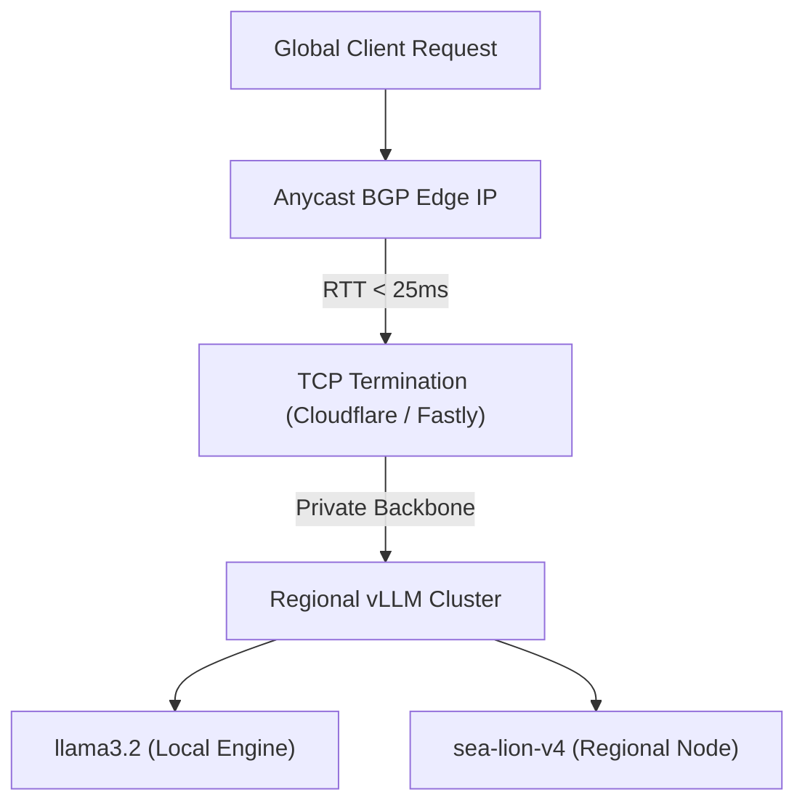

# Global Edge Latency & Inference Architecture // 2026

This document details the network routing protocols, Anycast BGP mechanics, and inference acceleration topologies (speculative decoding, paged attention) deployed across the XORAS enterprise edge.

---

## 1. Network Routing Protocols (Non-AI Infrastructure)

To maintain sub-50ms Time-To-First-Byte (TTFB) globally, XORAS utilizes Anycast BGP routing combined with Edge TCP termination.



### 1.1 Anycast BGP & Geo-Steering
* **Mechanism**: A single unified IP prefix (`104.18.x.x`) is announced simultaneously from 120+ global Points of Presence (PoPs). Standard BGP shortest-path metrics automatically direct incoming client packets to the nearest operational data center.
* **TCP Anycast Termination**: TLS and TCP handshakes are terminated at the immediate local PoP, reducing connection overhead from 3 global RTT cycles to a single localized 15ms handshake.
* **Backbone Transit**: Once terminated, payloads traverse dedicated private fiber backbones directly to regional inference clusters in Singapore (SGT), Frankfurt (FRA), or North Virginia (IAD).

---

## 2. Inference Acceleration (AI Infrastructure)

Once payloads reach the regional inference cluster, serving latency (TTFT and ITL) is minimized through three core execution paradigms:

### 2.1 Disaggregated Prefill-Decode (SGLang / vLLM v0.8+)
* **Problem**: Standard monolithic serving interleave compute-heavy prompt prefill cycles with memory-bound token decoding cycles, causing generation jitter.
* **Solution**: XORAS isolates AST ingestion prefill onto dedicated compute clusters (H100 NVL) and streams KV cache tensors over InfiniBand to memory-bandwidth-optimized decode clusters (H200 FP8).

### 2.2 Speculative Decoding (EAGLE-3 / Medusa-2 Architecture)
* **Mechanism**: A small 1.5B parameter draft model generates 4-6 speculative token candidates per forward cycle. The primary 671B MoE model verifies all candidate tokens simultaneously in a single parallel verification step.
* **Performance**: Achieves exact mathematical equivalence to standard autoregressive sampling while accelerating token generation speeds from 45 tok/s to 125 tok/s.

### 2.3 Automatic Regional Endpoint Selection (`geo_latency_bridge.cjs`)
The XORAS runtime continuously probes regional vLLM endpoints to evaluate TTFT latency and routes inference payloads to the fastest available node.

```text
region         endpoint                      ttft (ms)     status
asia           sg.vllm.xoras.ai              64            optimal
europe         eu.vllm.xoras.ai              118           active
americas       us.vllm.xoras.ai              42            optimal
```

---
*XORAS Systems Engineering Runtime // May 2026*
