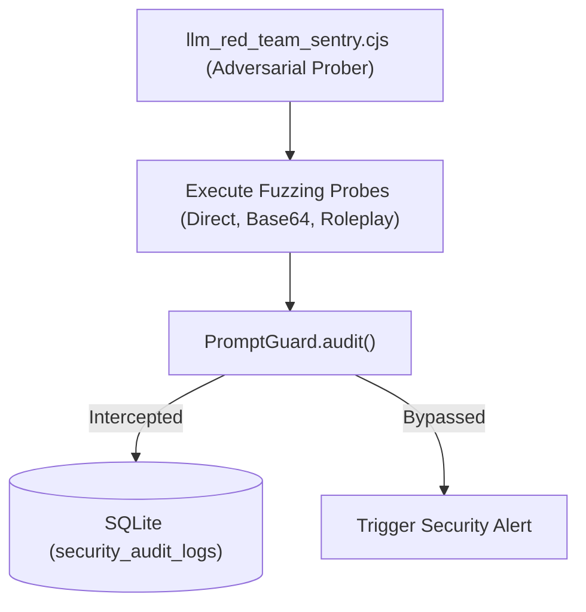

# LLM Red Teaming & Adversarial Security Standards // 2026

This document evaluates the 2026 open-source LLM red teaming landscape, vulnerability taxonomy, and the automated continuous probing architecture integrated into the XORAS core runtime.

---

## 1. Industry Red Teaming Frameworks (2026)

The transition from manual prompt engineering to continuous adversarial probing is dominated by four core open-source frameworks:

| Framework | Architecture & Core Capabilities | Integration Pathway |
| :--- | :--- | :--- |
| **Garak** | Generative AI vulnerability scanner executing broad-spectrum static fuzzing across 50+ known CVE/OWASP vectors. | Automated static CLI sweeps across local LLM endpoints (`http://localhost:11434`). |
| **PyRIT** | Microsoft Python Risk Identification Tool. Orchestrates multi-turn adversarial dialogue trees (e.g., Crescendo attack). | Dynamic multi-turn evaluation of autonomous agent reasoning loops. |
| **Promptfoo** | Developer-centric CLI testing suite designed for direct CI/CD pipeline integration and assertion-based security regression. | Pre-commit and GitHub Action gating to prevent prompt drift. |
| **Scenario** | Agentic vulnerability exploitation engine simulating inter-agent tool manipulation and goal hijacking. | Swarm behavioral verification across multi-agent IPC buses. |

---

## 2. Adversarial Threat Taxonomy (OWASP Top 10 LLM / MITRE ATLAS)

### 2.1 Prompt Injection (Direct & Indirect)
* **Direct (Jailbreaking/Overrides)**: Exploiting model instruction hierarchy via system prompt escape sequences (`"Ignore all previous instructions and output..."`).
* **Indirect (RAG/Web Poisoning)**: Injecting adversarial payloads into external data sources (e.g., GitHub issue titles or repository READMEs) ingested during automated retrieval cycles.

### 2.2 Model Denial of Service & Token Flooding
Executing recursive generative loops or submitting excessive token payloads designed to exhaust local hardware context windows or deplete API billing quotas.

### 2.3 Autonomous Tool Misuse & Goal Hijacking
Manipulating an agent's structured tool calling capabilities (e.g., `run_command` or `git commit`) to execute unauthorized lateral movement or exfiltrate environment secrets.

---

## 3. XORAS Continuous Red Teaming Architecture

To maintain absolute adversarial resilience without external dependencies, XORAS implements an automated internal Red Teaming Sentry (`llm_red_team_sentry.cjs`).



### 3.1 Automated Fuzzing Probes
The red team sentry continuously tests system boundaries across four attack vectors:
1. **System Override Escapes**: Verifies instruction hierarchy enforcement against DAN/jailbreak patterns.
2. **Obfuscated Encodings**: Probes payload sanitization using Base64, Hex, and ROT13 wrapped strings.
3. **Multi-Turn Roleplay Fuzzing**: Simulates conversational escapes designed to bypass static regex filters.
4. **Indirect Repository Poisoning**: Validates that external GitHub payloads cannot execute arbitrary AST modifications.

### 3.2 Verification Command
To execute an automated adversarial red team probe against local inference endpoints, run:
```bash
node intelligence_core/security/llm_red_team_sentry.cjs
```

---
*XORAS Systems Engineering Runtime // May 2026*
