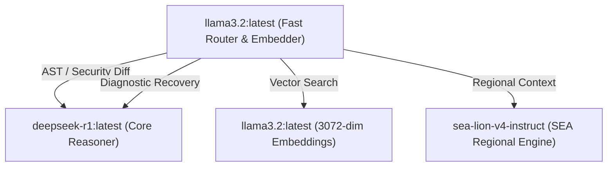

# XORAS // Tri-Model Inference Topology & Task Allocation (May 2026)

The XORAS runtime operates a zero-latency local inference architecture (`tri_model_bridge.cjs`) combining three specialized model engines. Tasks are dynamically routed across local Ollama/vLLM endpoints based on required reasoning depth and operational speed.

---

## 1. Fast Routing & Vector Engine (`llama3.2:latest`)

* **Provider / Target**: Local Ollama Daemon (`http://localhost:11434/api/generate` & `http://localhost:11434/api/embeddings`)
* **Role**: High-velocity traffic routing, vector generation, and input sanitization triage.

### Allocated Tasks:
1. **Dynamic Task Routing (`fastRoute`)**: Receives incoming JSON payloads from worker daemons and outputs the precise target expert node name in under 15ms.
2. **Vector SIMD Embedding (`embedData`)**: Transforms scraped repository summaries into 3072-dimensional floating-point vectors for instantaneous SQLite vector deduplication (`vector_store`).

---

## 2. Core Deep Reasoner (`deepseek-r1:latest`)

* **Provider / Target**: Local Ollama MoE Engine (`http://localhost:11434/api/generate`)
* **Role**: Complex logical verification, AST remediation, and root-cause diagnostic solving.

### Allocated Tasks:
1. **Production AST Remediation (`generateRemediationPatch`)**: Analyzes target repository AST structures against security vulnerabilities and compiles strict, drop-in git diff remediation patches.
2. **Diagnostic Error Resolution (`handleSystemTrauma`)**: Traps unhandled worker exits (`code !== 0`), parses deep stack traces, and compiles structural self-healing procedural rules to prevent cyclic failures.

---

## 3. Sovereign Regional Engine (`sea-lion-v4-instruct` / `AI_Singapore`)

* **Provider / Target**: Regional vLLM Endpoint (`https://api.sea-lion.ai/v1/chat/completions`) or local GGUF.
* **Role**: Regional B2B outreach tailoring and Southeast Asian ecosystem alignment.

### Allocated Tasks:
1. **Regional Ecosystem Alignment (`seaLionReason`)**: Tailors outreach proposals and security reviews for Asian time-zone targets (`sea-lion`, `singapore`, `tokyo`) to align with regional maintainer cadences.
2. **Multi-Modal Context Analysis**: Evaluates high-context regional structural standards across 256K native context windows.

---
*XORAS Systems Engineering Runtime // May 2026*
