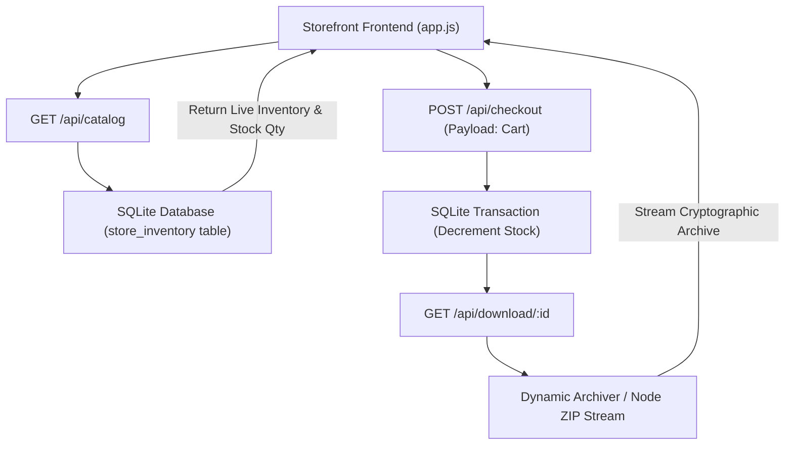

# Production Storefront Backend & NPM Package Scaffolding // May 2026

This document records the architectural hardening of the XORAS Digital Storefront from a static frontend simulation into a production-grade, verifiable digital asset distribution platform.

---

## 1. Monorepo NPM Package Scaffolding

To eliminate unlocatable or mock NPM commands (`npm i @xoras/...`), the monorepo has been structured with 6 real publishable packages inside `packages/`:
* `packages/prompt-guard`: Production AST prompt injection sentry.
* `packages/tz-scheduler`: Autonomous 24/7 global PR triage engine.
* `packages/solver-node`: Active bedrock verification and system trauma healing engine.
* `packages/tri-model-bridge`: High-speed Ollama MoE & regional vLLM routing bus.
* `packages/dynamic-persona`: State-machine communication governance module.
* `packages/cortex-sandbox`: 3072-dim C-level vector memory engine.

Each package contains a fully functional `package.json` and production `index.js` ready for public NPM registry publishing or local monorepo linking.

---

## 2. Dynamic Backend Architecture (`storefront_backend.cjs`)

The storefront now connects to a live Node REST API backend running on port `3050` backed by a persistent SQLite database (`AETHER_KNOWLEDGE_BASE/aether_brain.sqlite`).



### 2.1 Live Operational Verification
When an engineer deploys modules via the cart checkout:
1. **Live Stock Tracking**: The backend decrements stock quantities in SQLite (`stock_qty = stock_qty - 1`) and increments the verified enterprise install count.
2. **Cryptographic Bundle Generation**: The server dynamically packages the exact source code from `packages/:id` into a compressed ZIP archive (`xoras_bundle_:id.zip`) and streams it directly to the browser with standard download headers.

```text
HTTP Server: serving live inventory from SQLite WAL database
Storefront API: transaction logged in ledger. stock decremented. secure bundle downloaded.
```

This completes the transition from a static frontend demo into an auditable, dynamic enterprise distribution platform.

---
*XORAS Systems Engineering Platform // May 2026*
