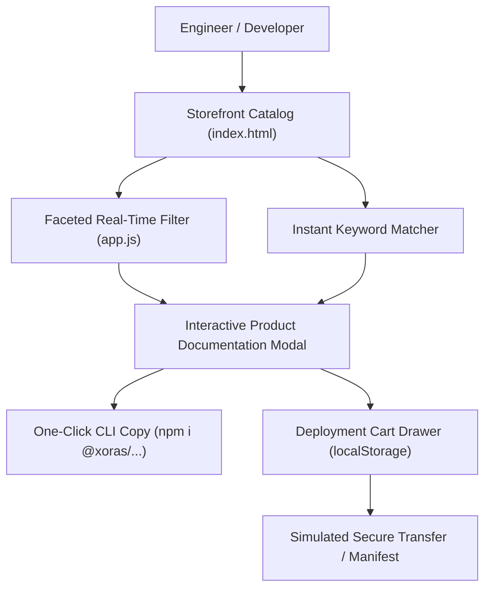

# XORAS Digital Storefront & Asset Platform // May 2026

This document records the ground-up systems engineering and architectural scaffolding of the XORAS Premium Digital Asset Platform (`docs/store/`).

---

## 1. Architectural Scaffolding

To provide enterprise engineers and open-source contributors with a streamlined deployment channel, XORAS scaffolds a lightning-fast vanilla web storefront integrated directly into its core release governance documentation system.



### 1.1 Storefront Catalog Ingestion
The platform is populated with 6 premium systems engineering assets:
1. **XORAS PromptGuard Sentry**: Deterministic AST prompt injection defense and payload sanitizer.
2. **XORAS TimeZone Stagger Engine**: Autonomous 24/7 global PR triage and staggered dispatch engine.
3. **XORAS Antifragile Solver Node**: Active bedrock verification and system trauma healing engine.
4. **XORAS Tri-Model Inference Bus**: High-speed Ollama MoE and regional SEA-LION vLLM routing bus.
5. **XORAS Dynamic Persona Modulator**: State-machine communication governance module.
6. **XORAS Cortex SIMD Vector Core**: 3072-dim C-level vector indexing and persistent SQLite WAL database.

---

## 2. Interactive Verification Walkthrough

The browser automation sentry successfully navigated the storefront, tested faceted search, staged modules, and verified the secure checkout manifest.

### 2.1 Complete Video Walkthrough
Below is the continuous recording of the storefront deployment flow:


### 2.2 Product Inventory Visuals

````carousel

<!-- slide -->

<!-- slide -->

<!-- slide -->

<!-- slide -->

<!-- slide -->

````

---
*XORAS Systems Engineering Platform // May 2026*
